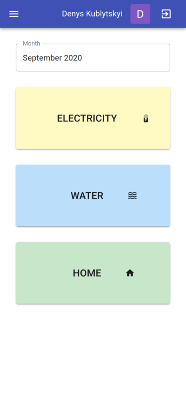
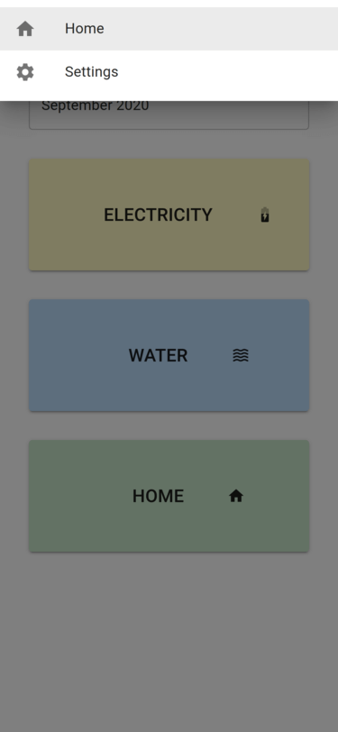
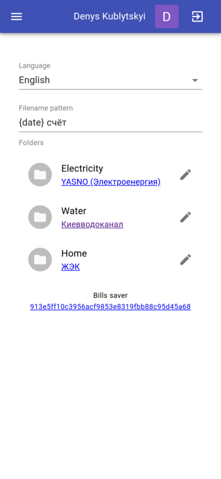
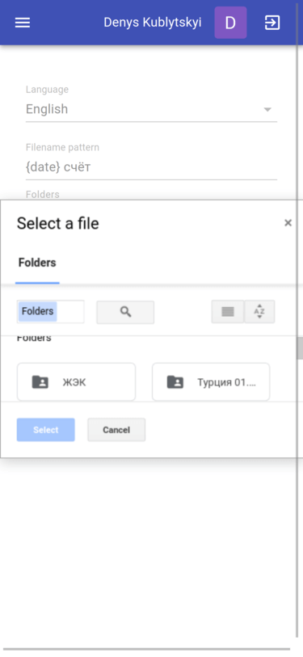

# bills-saver

**Problem**: every month I have to take photos of bills then go to a specific folder in Google Drive and upload photo here, repeat operations 3 times for electricity, water, home.

**Solution**: choose once Google Drive folders for electricity, water, home bills, and then only press the button, take photos of bills and they will be automatically uploaded to Google Drive.

